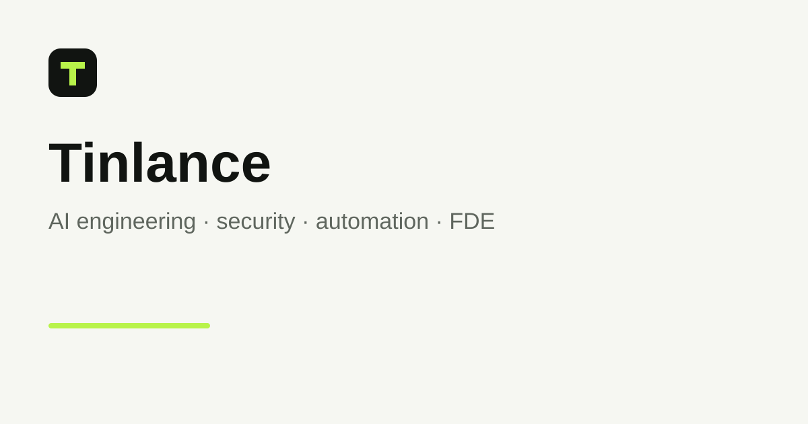

  
  <h1>Tinlance</h1>
  
<strong>AI engineering and Forward-Deployed Engineering for teams that need to ship secure, production-oriented AI systems around real business workflows.</strong>

> [!IMPORTANT]
> Tinlance is publicly visible for engineering transparency and verification, but the repository is **proprietary**. Public visibility does not grant an open-source reuse license. See [LICENSE](./LICENSE).

## Visual proof

The visual above is generated from the current application code. It is a product/architecture visual, not live telemetry or simulated operational data. The live public engineering surface is [tinlance.com/engineering](https://www.tinlance.com/engineering).

## Why Tinlance

Tinlance connects commercial discovery, customer delivery, engineering execution, security controls, evaluation, and productization without creating parallel authorities for identity, authorization, audit, or execution.

| Differentiator | What it means in this repository |
|---|---|
| Evidence-first | Public claims are classified as IMPLEMENTED, TESTED, VALIDATED, EXPERIMENTAL, or PLANNED. |
| Governed execution | Agents and automation operate through explicit identity, authorization, policy, approval, and audit boundaries. |
| FDE boundary | Tinlance owns the customer-facing platform; the authenticated FDE API separates the web application from FDE Mastery execution. |
| Security in the loop | Dependency audit, secret scanning, SAST, DAST, SBOM, container validation, and AI/agent regression gates are part of CI. |
| Productization path | M1/M3/M4/M5/M6/M7/M8/M9/M10/M11/M12/M13/M14 are represented as bounded platform capabilities rather than unrelated feature silos. |

## Quick start

The fastest way to inspect the web application locally:

~~~bash
git clone https://github.com/LloydCoder/Tinlance.git
cd Tinlance
corepack enable
pnpm install --frozen-lockfile
pnpm --filter @tinlance/web dev
~~~

Open http://localhost:3000.

The public pages are designed to run without production credentials. Authenticated, database-backed, billing, email, FDE, and customer-workspace flows require the corresponding environment and service configuration.

## Installation

### Prerequisites

| Component | Current repository requirement |
|---|---|
| Node.js | 22.x in CI |
| pnpm | 10.14.0 |
| Python | 3.12 for apps/fde-api |
| PostgreSQL | 16 for application CI/migrations |
| Docker | Required for container, SBOM, Trivy, and ZAP validation |

### Web application

~~~bash
corepack enable
pnpm install --frozen-lockfile
pnpm --filter @tinlance/web dev
~~~

### FDE API

~~~bash
cd apps/fde-api
python -m venv .venv
source .venv/bin/activate
pip install -e '.[test]'
uvicorn app.main:app --host 127.0.0.1 --port 8000
~~~

The FDE API exposes liveness at /health and readiness at /ready. Interactive API documentation is disabled by default and can be enabled deliberately with FDE_ENABLE_DOCS=true.

### Docker

The repository contains production-oriented Dockerfiles at apps/web/Dockerfile and apps/fde-api/Dockerfile. CI builds both images and validates non-root execution, health checks, vulnerability scans, and SBOM generation.

## Usage

### Basic web development

~~~bash
pnpm --filter @tinlance/web dev
~~~

Use the public routes to inspect the commercial and engineering surface:

- /assessment
- /engineering
- /engineering/fdse
- /fde-mastery
- /products
- /security
- /work

### Run the main validation suite

~~~bash
pnpm typecheck
pnpm lint
pnpm test
pnpm build
pnpm format:check
~~~

### FDE API validation

~~~bash
cd apps/fde-api
pip install -e '.[test]'
pytest -q
ruff check .
python -m pip check
~~~

The FDE API is an authenticated service boundary. Production execution requires a service credential, tenant-context signing, allowed-host configuration, and upstream FDE Mastery authentication. Do not expose those credentials in source or client-side code.

## Configuration

The application uses optional development configuration but validates a stricter set in production.

| Variable | Purpose | Default / requirement |
|---|---|---|
| NEXT_PUBLIC_APP_URL | Canonical application origin | Optional in development; required in production |
| BETTER_AUTH_URL | Better Auth origin | Optional in development; must match NEXT_PUBLIC_APP_URL in production |
| BETTER_AUTH_SECRET | Session/signing secret | Optional in development; at least 32 characters in production |
| DATABASE_URL | Neon/PostgreSQL connection | Required for database-backed flows and production |
| UPSTASH_REDIS_REST_URL | Distributed rate limiting | Required in production |
| UPSTASH_REDIS_REST_TOKEN | Distributed rate limiting credential | Required in production |
| PAYSTACK_SECRET_KEY | Billing integration | Required only when billing flows are enabled |
| RESEND_API_KEY | Transactional email | Required only when email flows are enabled |
| RESEND_FROM_EMAIL | Transactional sender | Required only when email flows are enabled |
| CRON_SECRET | Internal scheduled-worker protection | Required when outbox/cron production flows are enabled |
| FDE_ALLOWED_HOSTS | FDE API trusted-host allowlist | localhost,127.0.0.1,testserver by default |
| FDE_SERVICE_TOKEN | Tinlance-to-FDE API authentication | Required for authenticated execution |
| FDE_ENV | FDE API execution mode | production by default |
| FDE_ENABLE_DOCS | Enables FastAPI docs | false by default |

Never place secrets in NEXT_PUBLIC_* variables.

## Features

| Area | Current capability |
|---|---|
| Identity | Better Auth, sessions, organizations, memberships, invitations, RBAC |
| Customer workspace | Projects → assessments → findings → evidence → reports → remediation |
| Commercial | Assessments, leads, opportunities, proposals, booking, billing |
| API | Stable v1 contract, scoped organization credentials, idempotency, ETags, webhooks |
| FDE | Authenticated FastAPI gateway with tenant/domain validation and upstream OAuth |
| MCP | Registry, policy, security, server, approvals, and governed tool boundary |
| AI security | M7 policy/risk/approval/audit control plane |
| Evaluation | M8 deterministic and regression assurance |
| Agent runtime | M9 identity-bound executions, bounded capabilities, memory, approvals, recovery, evidence |
| Knowledge | M10 tenant-scoped knowledge and retrieval controls |
| Intelligence | M13 permissioned knowledge-moat workflow |
| Productization | M14 observation → pattern → opportunity → playbook → evaluation → productization |
| SDKs | TypeScript and Python clients for the stable API surface |
| CI/security | Tests, typecheck, lint, formatting, dependency audit, secret scan, Semgrep, ZAP, Trivy, SBOM, container validation |

## Architecture

The repository is a monorepo:

~~~text
Tinlance
├── apps/web        Next.js application, portal, admin, and API
├── apps/fde-api    Authenticated FastAPI execution gateway
├── packages/       TypeScript and Python SDKs
├── docs/           Architecture, API, security, operations, authority, and evidence
└── .github/        CI, security, dependency automation, issue forms
~~~

The central execution relationship is:

~~~text
Tinlance web
    |
    +--> M5 API / Core
    |       |
    |       +--> M7 Security / authorization
    |       +--> M6 MCP / tools
    |       +--> M8 Evaluation
    |       +--> M9 Agent Runtime
    |       +--> M10 Knowledge
    |
    +--> FDE API --> FDE Mastery
~~~

M7 remains the authorization/security authority. M6 remains the MCP/tool boundary. M8 remains evaluation authority. M9 is the controlled execution plane. The arrows are responsibility relationships, not a claim that every capability is a hard runtime dependency.

## Security and trust boundaries

Tinlance treats browser input, webhooks, email, AI/model output, MCP messages, tool output, and external API responses as untrusted.

Key rules:

- Authorization is server-side.
- Customer resources have explicit organization/tenant boundaries.
- High-impact operations use idempotency and/or approval controls.
- Secrets remain server-side.
- FDE execution is separated behind an authenticated service boundary.
- Production FDE execution uses upstream OAuth 2.0 client credentials.
- Auditability and request correlation are preserved across boundaries.
- Unrestricted AI-to-database access is not permitted.
- Unrestricted shell, arbitrary filesystem access, arbitrary HTTP, and autonomous red-team execution are not enabled by the M9 runtime.

See [SECURITY.md](./SECURITY.md) and the [security documentation](./docs/security/GATE-D-SUPPLY-CHAIN.md).

## Documentation

Start with the [documentation index](./docs/README.md).

| Topic | Reference |
|---|---|
| Architecture | [Canonical architecture](./docs/architecture/tinlance-architecture.md) |
| Decisions | [ADRs](./docs/decisions/README.md) |
| Evidence | [Evidence and trust](./docs/EVIDENCE-AND-TRUST.md) |
| FDE | [FDE integration](./docs/FDE-INTEGRATION.md) |
| API | [API v1](./docs/api/README.md) |
| OpenAPI | [v1 contract](./docs/api/openapi/v1.json) |
| Customer workspace | [M3](./docs/customer-workspace/M3_CUSTOMER_WORKSPACE.md) |
| Automation | [M4](./docs/automation/M4_FDE_AUTOMATION.md) |
| M7 | [AI Security Gateway](./docs/security/m7-ai-security-gateway.md) |
| M8 | [Agent Evaluation](./apps/web/docs/security/M8_AGENT_EVALUATION.md) |
| M9 | [Agent Runtime](./apps/web/docs/security/M9_AGENT_RUNTIME.md) |
| M10 | [Knowledge/RAG](./apps/web/docs/security/M10_KNOWLEDGE_RAG.md) |
| M13 | [Knowledge Moat](./docs/m13-proprietary-knowledge-moat.md) |
| M14 | [Productization](./docs/m14-consulting-software-flywheel.md) |
| CI | [Enterprise CI gates](./docs/ENTERPRISE-CI-GATES.md) |
| Production | [Gate E](./docs/security/GATE-E-PRODUCTION.md) |
| Scale | [Gate F](./docs/security/GATE-F-SCALE-SAAS.md) |

## Contributing

See [CONTRIBUTING.md](./CONTRIBUTING.md). Pull requests should be focused, tested, security-aware, and accompanied by documentation when behavior or architecture changes.

## License and acknowledgements

Tinlance is proprietary software owned by Tinlance Limited. See [LICENSE](./LICENSE).

Third-party libraries remain governed by their own licenses. Dependency metadata and lockfiles are committed to make the software supply chain inspectable.

Acknowledgements include the open-source projects that make the platform possible, including Next.js, React, TypeScript, Prisma, Better Auth, FastAPI, Pydantic, Vitest, pnpm, Turborepo, and the security tooling used in CI.

## Roadmap and maintenance posture

Roadmap

The repository maintains a phase ledger in [docs/PHASES.md](./docs/PHASES.md). Current platform work is organized around bounded commercial, customer-workspace, API, automation, MCP, security, evaluation, agent-runtime, knowledge, intelligence, and productization capabilities.

Roadmap entries are not evidence of implementation. Current code, tests, CI, and production verification remain authoritative.

Support and troubleshooting

For installation problems, include the exact command, runtime versions, commit SHA, and relevant non-sensitive logs.

For security problems, use [SECURITY.md](./SECURITY.md) rather than a public issue.

For contribution and review requirements, see [CONTRIBUTING.md](./CONTRIBUTING.md).

